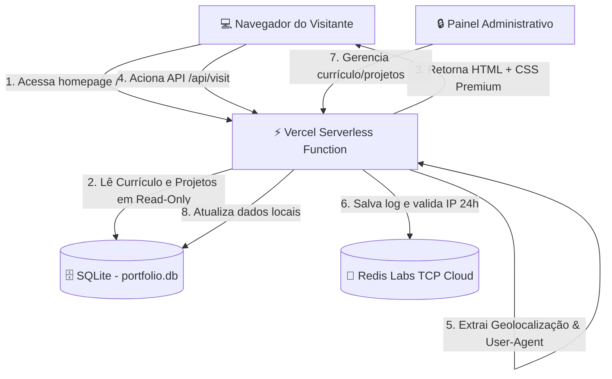

# 🏗️ Arquitetura de Dados e Engenharia do Portfólio

Este documento detalha o design de sistemas, a modelagem de dados, o fluxo de análises de tráfego e as decisões de arquitetura adotadas no portfólio profissional de **Mauricio Garcia Bimbu**.

---

## 🗺️ 1. Diagrama de Arquitetura do Sistema

O portfólio é hospedado de forma serverless na **Vercel** e integrado a um pipeline de dados híbrido que orquestra armazenamento relacional estático e análise de visitas dinâmicas.



---

## 🗄️ 2. Modelagem do Banco de Dados Relacional (SQLite)

O banco de dados relacional local (`portfolio.db`) é empacotado junto ao código do Next.js e lido na Vercel em modo **Read-Only (Somente Leitura)**, garantindo velocidade máxima de carregamento estático.

### Tabela `resume_items` (Currículo)
Armazena a trajetória profissional, acadêmica, certificações e cursos complementares.
```sql
CREATE TABLE resume_items (
    id INTEGER PRIMARY KEY AUTOINCREMENT,
    type TEXT NOT NULL,         -- 'job', 'academic', 'certification', 'course'
    title TEXT NOT NULL,        -- Cargo ou título da credencial
    institution TEXT NOT NULL,  -- Nome da empresa ou instituição de ensino
    start_date TEXT NOT NULL,   -- Data de início (ex: '02/2018')
    end_date TEXT,              -- Data de conclusão (ou 'Atual')
    description TEXT NOT NULL,  -- Atividades desempenhadas ou resumo da conquista
    technologies TEXT,          -- Ferramentas utilizadas (separadas por vírgulas)
    image_url TEXT,             -- Link local (/uploads/...) ou externo do selo oficial
    link TEXT,                  -- URL externa de verificação da credencial
    created_at TIMESTAMP DEFAULT CURRENT_TIMESTAMP
);
```

### Tabela `portfolio_items` (Cases & Projetos)
Guarda os detalhes dos principais projetos técnicos apresentados aos visitantes.
```sql
CREATE TABLE portfolio_items (
    id INTEGER PRIMARY KEY AUTOINCREMENT,
    title TEXT NOT NULL,
    description TEXT NOT NULL,
    category TEXT NOT NULL,     -- 'Engenharia de Dados', 'Ciência de Dados', etc.
    image_url TEXT,
    link TEXT DEFAULT '#',
    tags TEXT,                  -- Tags técnicas (ex: 'Python, dbt, SQL')
    created_at TIMESTAMP DEFAULT CURRENT_TIMESTAMP
);
```

### Tabela `skills` (Habilidades Técnicas)
Lista as ferramentas de dados nas quais Mauricio é especializado e o nível correspondente.
```sql
CREATE TABLE skills (
    id INTEGER PRIMARY KEY AUTOINCREMENT,
    name TEXT NOT NULL,
    level TEXT NOT NULL,        -- 'Avançado', 'Muito Bom', 'Bom'
    percentage INTEGER NOT NULL, -- Percentual de barra de progresso (0-100)
    image_url TEXT,             -- URL do logotipo da tecnologia
    created_at TIMESTAMP DEFAULT CURRENT_TIMESTAMP
);
```

### Tabela `settings` (Configurações Gerais)
Armazena parâmetros dinâmicos globais, como link para download do arquivo PDF do currículo.

---

## 📊 3. Engine de Analytics (Visitas e Métricas)

Para contornar a limitação de gravação de arquivos na Vercel, o sistema de auditoria e contagem de visitantes utiliza uma instância do **Redis Labs** conectada via protocolo **TCP seguro (TLS)**.

### Fluxo de Registro de Visita (`/api/visit`):
1. **Filtro Anti-Duplicação:** Ao receber uma requisição, o sistema valida no Redis a chave `visit_ip:[IP_DO_VISITANTE]:[DATA_ATUAL]`. Se essa chave já existir, a visita de página é tratada como recarregamento e ignorada na contagem para evitar inflar as estatísticas falsamente. Se não existir, a chave é criada com expiração automática de 24 horas.
2. **Extração de Geolocalização:** O servidor lê os headers de borda da Vercel para identificar o local do visitante sem a necessidade de APIs externas lentas:
   * País: `x-vercel-ip-country` (traduzido para nome amigável via mapeamento de ISO codes).
   * Estado: `x-vercel-ip-country-region`.
   * Cidade: `x-vercel-ip-city` (com tratamento para caracteres especiais).
3. **Detecção de Dispositivo e Browser:** O cabeçalho `user-agent` é analisado para identificar:
   * Dispositivo: `Mobile`, `Tablet` ou `Desktop`.
   * Navegador: `Chrome`, `Firefox`, `Safari`, `Edge`, `Opera` ou `Outros`.
4. **Persistência de Logs:** As informações são guardadas no Redis estruturadas em formato JSON dentro de uma lista indexada (`visit_logs`), permitindo que a API administrativa recupere as últimas 20 visitas rapidamente.

---

## ⚙️ 4. Simulador de Pipeline ETL (Interface Visual)

O portfólio conta com uma demonstração visual interativa de um fluxo **ETL (Extract, Transform, Load)** na página inicial. Ele exemplifica a arquitetura padrão adotada no tratamento do currículo Lattes:

```
[Fontes Brutas / PDFs] ──(Extract)──> [Normalização & Classificação Python] ──(Transform)──> [SQLite / DW Local] ──(Load)──> [Painel Dashboards]
```

* **Extração (E):** Simula a leitura e parse de metadados brutos do PDF do currículo.
* **Transformação (T):** Simula a limpeza de caracteres, formatação de datas e classificação automática de tags e tecnologias via Python.
* **Carga (L):** Grava a estrutura normalizada no SQLite, atualizando o painel de métricas analíticas e a interface do usuário.

---

## 🎨 5. Design System e Controle de Temas Automático

O site adota uma abordagem moderna, livre de Tailwind CSS (CSS Vanilla), para otimização e controle completo de renderização de pixels.

* **Modo Escuro / Claro Automático:** Utiliza a biblioteca `next-themes` mapeando as preferências do sistema operacional (`prefers-color-scheme`). O layout administrativo e público trocam dinamicamente suas variáveis CSS de cor de fundo e texto instantaneamente.
* **Modo Lightbox:** Ao clicar nas imagens de certificações/cursos, um popup modal centrado abre sob um fundo desfocado (`backdrop-filter: blur(8px)`) com animações de zoom suaves, permitindo visualizar as imagens em alta resolução sem sair do site.

---

## 💡 6. Boas Práticas de Desenvolvimento Local e Deploy

1. **SQLite sem Locks:** O utilitário do banco de dados local (`src/lib/db.ts`) desativa o modo de escrita concorrente WAL (`PRAGMA journal_mode = delete`) para garantir que os arquivos temporários não causem conflito com a estrutura somente-leitura da Vercel ao dar `git push`.
2. **Conexões TLS Flexíveis:** O driver do Redis (`ioredis`) é configurado com `rejectUnauthorized: false` para aceitar certificados autorizados em nuvens serverless.
3. **Navegação com Âncoras:** A navegação do site mantém o padrão `#secao` para permitir compartilhamento direto (ex: `site.com/#portfolio`), preservando o histórico nativo do navegador do visitante.
