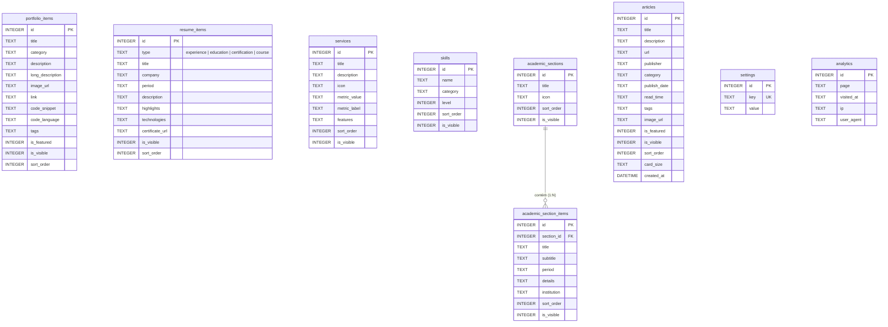

# 📊 Portfólio & Plataforma de Analytics - Mauricio Garcia Bimbu

Plataforma Web full-stack moderna e interativa desenvolvida com **Next.js 14 (App Router)**, **TypeScript**, **SQLite** e **CSS Modules**. O sistema é projetado para apresentar cases de **Engenharia de Dados, Ciência de Dados, Big Data e Machine Learning**, contando com um **Painel Administrativo completo**, visualizador de **Currículo Lattes Acadêmico**, pré-visualizador de **código-fonte e notebooks**, **blog/artigos técnicos** e métricas em tempo real.

---

## 🚀 Tecnologias Utilizadas

- **Framework Frontend/Backend**: Next.js 14 (App Router)
- **Linguagem**: TypeScript (Type-safe)
- **Banco de Dados**: SQLite com driver `better-sqlite3` (migrações e auto-seeding embutidos)
- **Estilização**: CSS Modules (com variáveis de design tokens em `globals.css`) e Lucide Icons
- **Internacionalização**: Suporte nativo a **Português (PT)** e **Inglês (EN)**
- **Tema**: Alternador dinâmico de **Modo Claro (Light)** e **Modo Escuro (Dark)**

---

## 📌 Principais Funcionalidades

1. **Vitrine de Projetos & Modal de Detalhes**:
   - Apresentação de cases com tags, links externos para repositórios e capturas de tela.
   - **Pré-visualizador de Código & Notebooks**: Janela na vitrine para visualização e cópia de scripts Python, queries SQL ou trechos de notebooks Jupyter.
   - Filtros por categoria e busca em tempo real.

2. **📰 Módulo Independente de Artigos & Blog (/artigos)**:
   - Vitrine técnica para publicação de artigos do Medium, newsletters do LinkedIn ou papers de pesquisa acadêmica (USP/UFC).
   - Suporte a **Categorias Personalizadas Ilimitadas** (Engenharia de Dados, Ciência de Dados, ML & IA, etc.).
   - Suporte a tamanhos flexíveis de cartão no grid: **Padrão (1 Coluna)**, **Destaque (2 Colunas)** e **Largura Total (3 Colunas)**.
   - Filtros dinâmicos por categoria e seletor de limite de exibição por página.

3. **🎓 Currículo Lattes Acadêmico (/academico)**:
   - Apresentação estruturada das seções acadêmicas (Formação, Artigos Publicados, Participação em Eventos, Projetos de Pesquisa, Bancas).
   - Gerenciamento dinâmico pelo Admin com adição, edição e reorganização de itens.

4. **💼 Seção de Trajetória, Serviços & Métricas**:
   - Timeline de experiência profissional com expansão de detalhes de projetos e tecnologias utilizadas.
   - Cartões de Serviços oferecidos acompanhados de métricas de impacto de negócios.

5. **🔐 Painel Administrativo Protegido (/admin)**:
   - Acesso seguro via autenticação de senha.
   - O menu de navegação administrativa permanece oculto até a autenticação do usuário.
   - **Controle de Visibilidade**: Alternador (`👁️ Visível` / `👁️‍🗨️ Oculto`) em projetos, cursos, serviços e artigos sem necessidade de exclusão do banco de dados.
   - **Agrupamento Colapsável (Accordion)**: Minimiza e expande categorias para facilitar a navegação em bases com dezenas de artigos.
   - Reordenação dinâmica (`▲ Subir` / `▼ Descer`) de itens em todas as seções.
   - Gerenciador centralizado de redes sociais e links úteis (GitHub, LinkedIn, Kaggle, Medium, ORCID, Lattes, WhatsApp).

6. **📊 Analytics & Métricas de Acesso**:
   - Contador de visualizações de páginas e rastreamento de acessos únicos armazenados no banco de dados.

---

## 🏛️ Arquitetura do Sistema

O projeto segue a arquitetura **Next.js App Router**, combinando rotas de API Serverless com renderização dinâmica no cliente e servidor.

```
projeto/
├── public/                    # Ativos estáticos (favicon.ico, icon.png, uploads)
├── scripts/                   # Scripts utilitários de banco e carga inicial
├── src/
│   ├── app/                   # App Router (Páginas, Layouts e APIs)
│   │   ├── academico/         # Página pública do Lattes Acadêmico
│   │   ├── admin/             # Painel Administrativo autenticado
│   │   │   ├── academico/     # Gestão do Lattes Acadêmico
│   │   │   ├── artigos/       # Gestão de Artigos & Blog
│   │   │   ├── login/         # Tela de autenticação por senha
│   │   │   ├── portfolio/     # Gestão de Projetos
│   │   │   ├── resume/        # Gestão de Trajetória & Links
│   │   │   ├── servicos/      # Gestão de Serviços & Métricas
│   │   │   ├── skills/        # Gestão de Habilidades
│   │   │   └── stats/         # Painel de Estatísticas
│   │   ├── api/               # API Routes RESTful (CRUD SQLite)
│   │   │   ├── academico/
│   │   │   ├── articles/
│   │   │   ├── auth/
│   │   │   ├── portfolio/
│   │   │   ├── resume/
│   │   │   ├── services/
│   │   │   ├── settings/
│   │   │   ├── skills/
│   │   │   └── visit/
│   │   ├── artigos/           # Página pública independente de Blog/Artigos
│   │   ├── globals.css        # CSS global e variáveis de design tokens
│   │   ├── layout.tsx         # Root Layout com Metadata e ThemeProvider
│   │   ├── page.module.css    # Estilos CSS Modules da Home
│   │   └── page.tsx           # Homepage do Portfólio
│   ├── components/            # Componentes React Reutilizáveis
│   │   ├── AcademicClient.tsx
│   │   ├── AdminAcademicClient.tsx
│   │   ├── ArticlesClient.tsx
│   │   ├── PortfolioClient.tsx
│   │   ├── TerminalConsole.tsx
│   │   ├── ThemeProvider.tsx
│   │   └── ThemeToggle.tsx
│   └── lib/                   # Utilitários de infraestrutura
│       ├── db.ts              # Conexão SQLite, Migrations e Auto-seeding
│       └── translations.ts    # Dicionário de tradução PT/EN
├── portfolio.db               # Arquivo SQLite local de dados
├── next.config.mjs            # Configuração do Next.js
└── package.json               # Dependências do projeto
```

---

## 🗄️ Modelo de Dados & Relacionamento de Tabelas (ERD)

Abaixo está o **Diagrama de Entidade-Relacionamento (ERD)** do banco de dados SQLite (`portfolio.db`):



### 🔗 Descrição das Conexões:
- **`academic_sections` ── (1:N) ── `academic_section_items`**: Cada seção do Lattes Acadêmico (ex: *Formação*, *Projetos de Pesquisa*) possui zero ou múltiplos itens cadastrados vinculados pela chave estrangeira `section_id`.
- **`settings`**: Tabela de chave-valor (`key`, `value`) utilizada para armazenar parâmetros globais do site, como textos conceituais, links externos das redes sociais no rodapé/contato, subtítulo do blog e limite de exibição por página.
- **`analytics`**: Registra cada acesso do visitante armazenando a página, data/hora e metadados de acesso.

---

## 🛠️ Como Executar o Projeto Localmente

### Pré-requisitos
- **Node.js**: Versão 18.x ou superior
- **npm**: Versão 9.x ou superior

### Passos para Instalação

1. **Clonar o Repositório**:
   ```bash
   git clone https://github.com/Mauricio318/portfolio-analytics.git
   cd portfolio-analytics
   ```

2. **Instalar as Dependências**:
   ```bash
   npm install
   ```

3. **Iniciar o Servidor de Desenvolvimento**:
   ```bash
   npm run dev
   ```

4. **Acessar no Navegador**:
   - Site Principal: `http://localhost:3000`
   - Lattes Acadêmico: `http://localhost:3000/academico`
   - Blog / Artigos: `http://localhost:3000/artigos`
   - Painel Administrativo: `http://localhost:3000/admin`

---

## 🔑 Acesso ao Painel Admin

- **URL do Admin**: `/admin/login`
- **Senha Padrão**: Definida nas configurações do sistema ou variável de ambiente `ADMIN_PASSWORD`.
- **Comportamento**: Quando logado, um cookie seguro ou sessão é ativado, exibindo a barra de controle administrativa e permitindo atualizações instantâneas no banco de dados.

---

## 📝 Licença

Desenvolvido por **Mauricio Garcia Bimbu**. Todos os direitos reservados.
